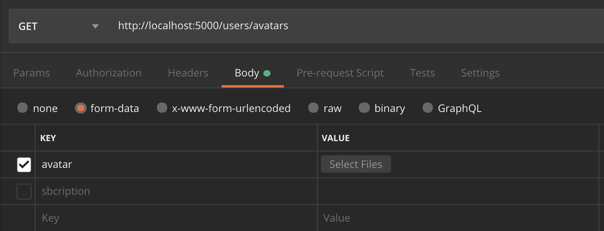

**Читать на других языках: [Русский](README.md), [Українська](README.ua.md).**

# Домашнее задание 5

Создай ветку `hw05-avatars` из ветки `master`.

Продолжи создание REST API для работы с коллекцией контактов. Добавь возможность загрузки аватарки пользователя через [Multer](https://github.com/expressjs/multer).

## Шаг 1

Создай папку `public` для раздачи статики. В этой папке сделай папку `avatars`. Настрой Express на раздачу статических файлов из папки `public`.

Положи любое изображение в папку `public/avatars` и проверь что раздача статики работает. При переходе по такому URL браузер отобразит изображение.

```shell
http://localhost:<порт>/avatars/<имя файла с расширением>
```

## Шаг 2

В схему пользователя добавь новое свойство `avatarURL` для хранения изображения.

```shell
{
  ...
  avatarURL: String,
  ...
}
```

- Используй пакет [gravatar](https://www.npmjs.com/package/gravatar) для того чтобы при регистрации нового пользователя сразу сгенерить ему аватар по его `email`.

## Шаг 3

При регистрации пользователя:

- Создавай ссылку на аватарку пользователя с помощью [gravatar](https://www.npmjs.com/package/gravatar)
- Полученный URL сохрани в поле `avatarURL` во время создания пользователя

## Шаг 4

Добавь возможность обновления аватарки, создав эндпоинт `/users/avatars` и используя метод `PATCH`.



```shell
# Запрос
PATCH /users/avatars
Content-Type: multipart/form-data
Authorization: "Bearer {{token}}"
RequestBody: загруженный файл

# Успешный ответ
Status: 200 OK
Content-Type: application/json
ResponseBody: {
  "avatarURL": "тут будет ссылка на изображение"
}

# Неуспешный ответ
Status: 401 Unauthorized
Content-Type: application/json
ResponseBody: {
  "message": "Not authorized"
}
```

- Создай папку tmp в корне проекта и сохраняй в неё загруженную аватарку.
- Обработай аватарку пакетом [jimp](https://www.npmjs.com/package/jimp) и задай для нее размеры 250 на 250
- Перенеси аватарку пользователя из папки tmp в папку `public/avatars` и дай ей уникальное имя для конкретного пользователя.
- Полученный `URL` `/avatars/<имя файла с расширением>` сохрани в поле `avatarURL` пользователя

## Дополнительное задание - необязательное

### 1. Написать unit-тесты для контроллера входа (signup)

При помощи [Jest](https://jestjs.io/ru/docs/getting-started)

- ответ должен иметь статус-код 200
- в ответе должен возвращаться токен
- в ответе должен возвращаться объект `user` с 2 полями `email` и `subscription`, имеющие тип данных `String`

